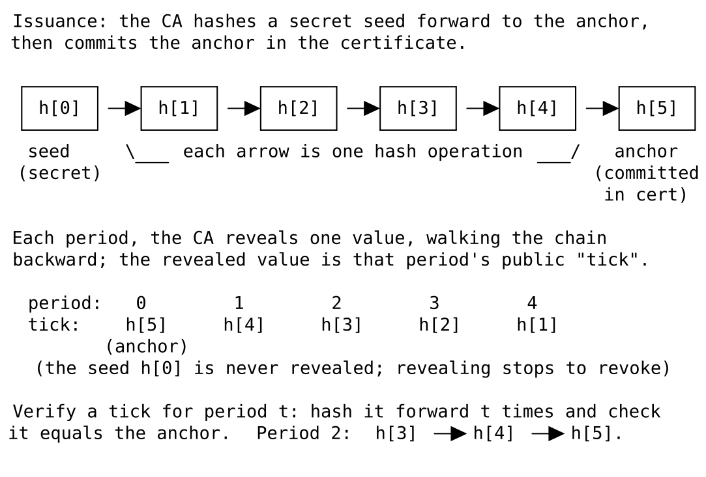
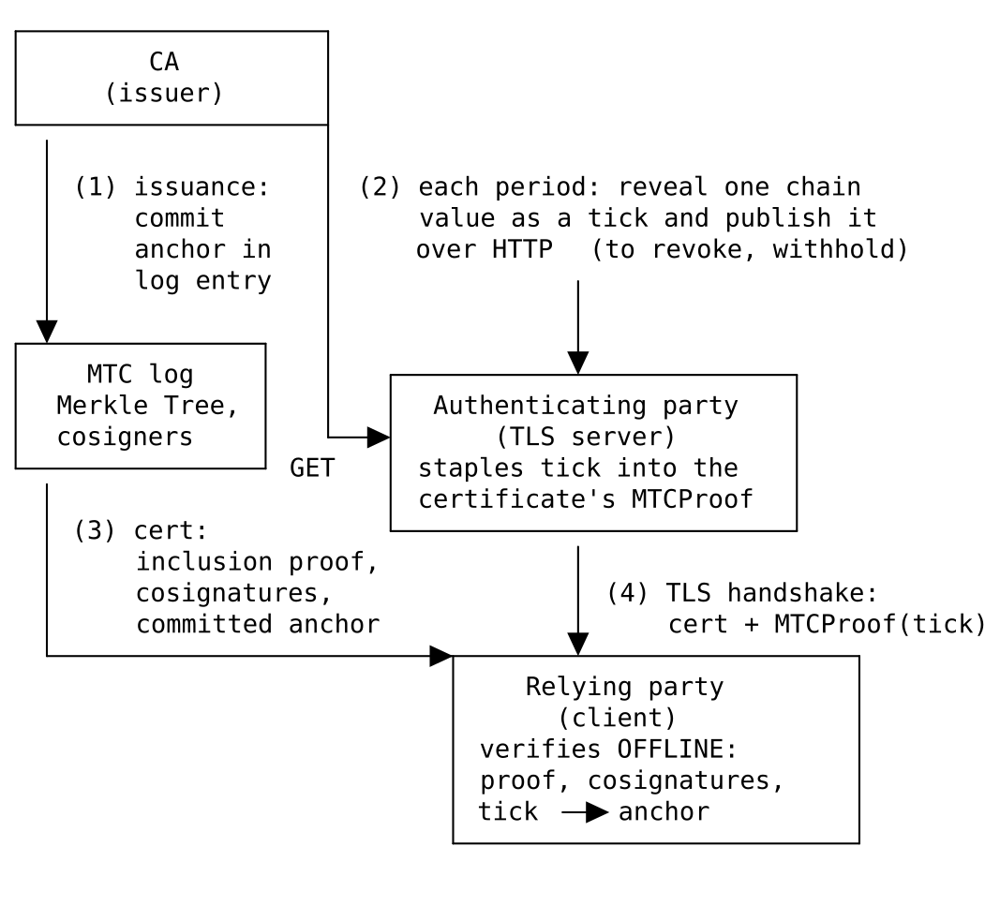

<!-- _class: lead -->

# MTCRS
## Merkle Tree Certificates: Revocation Status

**Timely, enforceable revocation for MTC — using nothing but a hash function.**

Rob Stradling · Sectigo
PLANTS WG · `draft-strad-plants-mtcrs`

---

# You already know MTC

- Certificates are **entries in a cosigned Merkle Tree**.
- The **MTCProof** carries an **inclusion proof + cosignatures** = *"this certificate is authentic."*
- Base MTC deliberately uses a **short-lived model**: expiry is the primary revocation story.
- It doesn't *mandate* an always-on revocation service — that lean design is the whole point.
  <span class="small muted">(Traditional methods like OCSP/CRLs aren't forbidden; browser policy is still open.)</span>

**MTCRS keeps that simplicity — it just adds one missing guarantee.**

---

# The gap MTCRS fills

- Real deployments allow long-ish lifetimes: **Chrome's draft MTC policy → up to 47 days**.
- Over 47 days, **key compromise** or **misissuance** can do real damage before natural expiry.
- Base MTC leaves certificate-level revocation **out of scope**: it says CRLs/OCSP "apply unchanged" and defines only coarse **serial-range** revocation for CA misbehaviour (§7.5).
  - The practical fallback is **out-of-band, vendor-controlled** push lists (CRLite / CRLSets) — **not universal**, and nothing in-band.

> There is no **in-band** way for the CA to say *"stop trusting this one, now."*

**MTCRS is that in-band signal.**

---

# The idea in one sentence

> At issuance the CA hides a **hash-chain anchor** in the certificate.
> Each period it **reveals the next link** as a proof of non-revocation.
> To revoke, it simply **stops revealing**.

- The Merkle Tree inclusion proof says **"authentic."**
- That revealed link, packaged with its period number, is a **tick** — it says **"still valid *right now*."**
- Together: not just *was issued*, but *may be relied on now*.

---

# Picture: the hash-chain lifecycle



<span class="small muted">Generated **forward** at issuance (secret seed → public anchor) · revealed **backward**, one link per period · verified **forward** back to the committed anchor.</span>

---

# How it works — 1. At issuance

The CA builds a **hash chain** per certificate:

```
seed = random 32 bytes = h[0]
h[i] = Hash(h[i-1])          for i = 1 .. chain_length
anchor = h[chain_length]     <-- committed into the certificate
```

- `chain_length = ceil(lifetime / revocation_period)`  (e.g. 47 days / 1 hour ≈ 1128).
- The **anchor** goes into the log entry as an X.509 extension → **committed to the Merkle Tree**.
- **One-way hashing** ⇒ knowing a link **can't** compute the *next* (earlier-generated) link.

<span class="small muted">Simplified: each step hashes the previous value together with per-entry identifiers (domain separation). The chain is generated **forward** from the secret seed, but revealed **backward**.</span>

---

# How it works — 2. Each period, reveal a "tick"

At the start of **period `t`**, the CA reveals `h[chain_length - t]`.

```
period 0:  anchor h[L]      (public — no assurance, grace period)
period 1:  h[L-1]           (first secret link)
period 2:  h[L-2]
   ...
```

- **Verify:** hash the revealed value `t` times → must equal the committed anchor.
- Revealing in **reverse** order is what makes it secure: today's link never predicts tomorrow's.
- A **tick** = `{ 4-byte period, 32-byte value }` = **36 bytes**.

---

# How it works — 3. Revocation = stop revealing

- To **revoke**: the CA just **stops publishing** new links.
- Once the last revealed link's period ends, **no one** can produce a valid tick…
  - …because that would require **inverting the hash**.
- **Latency:** a certificate becomes unusable within **at most two periods** (e.g. ≤ 2 hours).

**No CRL to publish. No signature to compute. Just silence.**

---

# How it works — 4. The server presents the tick

- The server fetches its current tick each period: **one plain HTTP GET, 36 bytes, no crypto**.
  - `GET {base}/.well-known/mtcrs/v1/tick/{tbs_cert_entry_hash}`
- It writes the tick into the **MTCProof** (the `signatureValue`).
- MTCProof is **not** committed to the tree ⇒ the tick can be refreshed freely; the inclusion proof and cosignatures are untouched.

<span class="small">The relying party **never fetches anything** — it verifies the embedded tick offline.</span>

---

# How it works — 5. The relying party verifies

Everything needed comes **from the certificate itself**:

1. Read the **anchor** + `revocation_period` from the committed extension.
2. Read the **tick** `{period, value}` from the MTCProof.
3. Check `tick.period` ≈ its own clock (current ±1 period — for skew/caching).
4. Hash `value` forward `period` times → **must equal the anchor**.

<br>

> **Self-authenticating.** No new signatures, no new trust, no responder, no network call.

---

# How it all fits together



<span class="small muted">CA commits the anchor at issuance and publishes a tick each period · the server staples the current tick into the MTCProof · the relying party verifies everything **offline**.</span>

---

# Why this shape? Key properties

| Property | What it buys |
|---|---|
| **Timely** | Revocation effective within ~2 periods, regardless of client update state |
| **No per-check signatures** | CA reveals a precomputed value; **zero signing load** even at 10⁹ certs |
| **Mandatory / un-strippable** | Tick is *part of* the cert presentation → relying parties **hard-fail** on absence |
| **Self-authenticating** | Verified against the tree-committed anchor → **no new trust relationships** |
| **Tiny** | **36 bytes** per handshake; ~40–50 bytes added per log entry |
| **Post-quantum robust** | Rests on preimage resistance only; **no PQ signatures on the revocation path** |

---

<!-- _class: lead -->

# How MTCRS stacks up

### Comparison against every other revocation method
### — current and falling out of favour

---

# Comparison — methods falling out of favour

<div class="tiny">

| Method | Status | Enforce­ment | Latency bound | Per-check CA signing | RP privacy | New trust / infra | Handshake bytes |
|---|---|---|---|---|---|---|---|
| **CRLs** (RFC 5280) | Fading | Soft-fail in practice | Hours–days | No (batch-signed) | OK (if cached) | CRL fetch/DP | 0 (out-of-band, large) |
| **Live OCSP** (RFC 6960) | Abandoned by browsers | Soft-fail | Minutes–hours | **Yes, per check** | **Leaks to CA** | Responder fleet | 0 (extra RTT) |
| **OCSP stapling** | Low adoption | **Strippable** → soft-fail | Response validity | Yes (per response) | OK | Responder + TLS ext | ~hundreds–thousands |
| **OCSP Must-Staple** (RFC 7633) | Near-dead | Hard-fail *if it works* | Response validity | Yes | OK | Responder; fragile | ~hundreds–thousands |
| **➡ MTCRS (hash chain)** | **This draft** | **Hard-fail, un-strippable** | **≤ 2 periods (e.g. 2h)** | **None** | **RP never fetches** | **CA only; no new trust** | **36** |

</div>

<span class="small muted">MTCRS row repeated as the reference point. In-use methods on the next slide.</span>

---

# Comparison — methods still in use

<div class="tiny">

| Method | Status | Enforce­ment | Latency bound | Per-check CA signing | RP privacy | New trust / infra | Handshake bytes |
|---|---|---|---|---|---|---|---|
| **Short-lived certs** | In use (base MTC) | Passive expiry | = remaining lifetime | No | OK | Heavy re-issuance | 0 |
| **CRLSets / OneCRL** | In use (browsers) | Hard-fail, **partial** | Hours–days (push) | No | OK | **Vendor feed** | 0 |
| **CRLite** | In use (Mozilla) | Hard-fail, **partial** | Hours–days (push) | No | OK | **Vendor feed** | 0 |
| **Per-cert signatures (PQ OCSP-like)** | Rejected | Hard-fail | ~1 period | **Yes — PQ, huge** | OK | Signing per period | ~3300 (ML-DSA-65) |
| **➡ MTCRS (hash chain)** | **This draft** | **Hard-fail, un-strippable** | **≤ 2 periods (e.g. 2h)** | **None** | **RP never fetches** | **CA only; no new trust** | **36** |

</div>

<span class="small muted">Push lists (CRLite / CRLSets) are enforced but vendor-controlled and partial; MTCRS is CA-operated and universal.</span>

---

# The one-line takeaway from the table

- **Push lists (CRLite / CRLSets):** universal-*ish* but **vendor-controlled** and reach only subscribers. Great **defense-in-depth**, not a universal baseline.
- **OCSP family:** either **soft-fail** (useless vs. active attacker) or **fragile + heavy signing**.
- **Shorter lifetimes:** move the cost to **issuance & relying-party sync**, ~100× heavier — and still can't act on what the CA *learns* mid-life.

> **MTCRS = the enforcement of a push list + the reach of the cert itself + the cost of a hash.**

---

# "Didn't Micali try this in 1996?"

<div class="small">

Hash-chain revocation is **Micali's CRS** — the "CRS" in MTCRS is a nod to it.
It never shipped in the Web PKI, and **not because the crypto was wrong**:

- The cheap part was *verifying*; the hard part was **getting a fresh token to the client every period**.
- Classic X.509 had **nowhere free to carry it** ⇒ the client had to **fetch** it ⇒ straight back to OCSP's latency, privacy, and soft-fail problems.
- OCSP chose **signatures for retrofit + flexibility**, not because hash chains were worse — the blocker was **delivery**, which MTC now provides.

**What's different now — MTC gives the token a free ride:**

- The tick travels **inside the certificate presentation** (MTCProof) — the client fetches **nothing**.
- The anchor is **already committed** in the Merkle Tree — no new signature or trust.
- Enforcement is **hard-fail by construction** — the very gap that sank CRS and OCSP.

> Same primitive; the missing piece was the **delivery channel** — and MTC *is* that channel.

</div>

---

# Objections & responses (1/2)

<div class="small">

- **"MTC was designed to *avoid* revocation complexity."**
  Budget is *one hash per handshake*, not an OCSP fleet. No responder certs, no new protocol.

- **"This adds a new availability dependency."**
  Bounded: one period of buffer, a cacheable 36-byte GET (not a signing responder), a widenable acceptance window, and multi-CA fallback.

- **"Just use shorter lifetimes."**
  ~2-hour certs give the same latency but ~100× the issuance/sync cost — and still can't act on new information mid-lifetime.

- **"CRLite/CRLSets already solve this."**
  Complementary. Those are vendor-controlled, best-effort, subscribers-only. MTCRS is CA-operated, deterministic-latency, enforced by **every** RP (incl. IoT / non-browser).

- **"OCSP can answer historical status; can MTCRS?"**
  No — by design. MTCRS is a **handshake-time liveness** check, not a queryable "valid at time *T*" database. That audit niche stays with OCSP.

</div>

---

# Objections & responses (2/2)

<div class="small">

- **"Browsers already abandoned handshake/online revocation."**
  They abandoned **soft-fail** and **RP-side fetching**. MTCRS is **hard-fail by construction** and the RP **never fetches**. Their move *validates* this design.

- **"Modifying MTCProof breaks implementations."**
  True — needs **one** base-spec change (the Section 7.2 "extra data" check). Zero bytes when unused ⇒ byte-identical to base. MTC is greenfield: fold it in now.

- **"CA seed compromise is catastrophic."**
  No worse than signing-key compromise (which already forges certs). Recovery = base MTC revoked-ranges. Seeds can even be derived from one HSM-held secret.

- **"Verification cost grows with cert age."**
  ≤ ~1127 SHA-256 ≈ **10–20 µs** — dwarfed by the handshake's asymmetric crypto. Resumed sessions pay nothing.

- **"Symmetric hash chains are a PQ distraction."**
  Backwards: they keep **PQ signatures off the revocation path** entirely. 36 unsigned bytes vs. thousands.

</div>

---

# What MTCRS asks of the base spec

**Exactly one required change:**

- Amend the **Section 7.2 "extra data" check** so the MTCProof may carry the tick when the anchor extension is present (byte-identical to base MTC when it isn't).

**Everything else layers on top, unchanged:**

- New X.509 extension for the anchor · hash-chain construction · verification · HTTP tick distribution.
- Merkle tree, cosigner, and log software stay **MTCRS-agnostic**.

<span class="small muted">Optional: register a `hash_chain_anchor` entry-extension type as an alternative home for the anchor.</span>

---

<!-- _class: lead -->

# Summary

**MTCRS = timely, mandatory, self-authenticating revocation for MTC.**

- Hash chain: **reveal to assert, withhold to revoke.**
- **36 bytes** per handshake · **zero** per-check signatures · **no new trust**.
- **Hard-fail** where OCSP could only soft-fail; **universal** where push lists are partial.
- **One** small change to the base spec — and MTC is greenfield, so *now* is the time.
- **Experimental** today; intended for the **Standards Track** if PLANTS is willing.

**`draft-strad-plants-mtcrs` — feedback welcome.**
